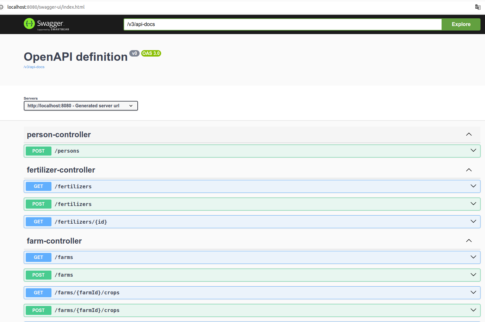
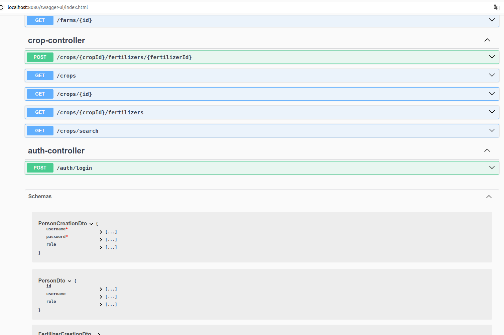

#  🌱 Agrix - Gestão e Monitoramento de Fazendas  # 


## 🌠[](https://github.com/SamuelRocha91/Agrix/blob/main/README.md) [](https://github.com/SamuelRocha91/Agrix/blob/main/README_es.md) [](https://github.com/SamuelRocha91/Agrix/blob/main/README_en.md) [](https://github.com/SamuelRocha91/Agrix/blob/main/README_ru.md) [](https://github.com/SamuelRocha91/kotlinVirtualMenu) [](https://github.com/SamuelRocha91/Agrix/blob/main/README_ar.md)

## 📜 Introdução

O projeto Agrix é um projeto avaliativo desenvolvido no módulo de Java do curso de Desenvolvimento Web da Trybe. O projeto envolveu o uso de Java, Maven, Docker, MySQL e quase todo o ecossistema Spring. A aplicação foi construída com total liberdade de implementação, abrangendo desde a manipulação de código até a configuração.

A aplicação tem como objetivo gerenciar e monitorar as fazendas participantes que buscam aperfeiçoar suas tecnologias e usar o solo de forma responsável. O sistema inclui rotas para autenticação, autorização, cadastro de fazendas, plantações, fertilizantes e muito mais.

## 📈 Diagrama Banco de dados


## 🛤️ Rotas





## 🛠️ Funcionalidades Implementadas

- **Autenticação e Autorização**: Implementação de segurança usando Spring Security para gerenciar o acesso às rotas da aplicação.
- **Cadastro de Entidades**: Rotas para o cadastro de fazendas, plantações e fertilizantes.
- **Gestão de Estoque e Plantação**: Funcionalidades para gerenciar o estoque de fertilizantes e as plantações nas fazendas.
- **API REST**: Desenvolvimento de uma API REST para interação com o sistema.
- **Gerenciamento de Erros**: Implementação de gerenciamento de erros usando o Spring Web.
- **Docker**: Criação de um Dockerfile para configuração da aplicação para execução no Docker.

## 📚 Habilidades Desenvolvidas

Durante o desenvolvimento deste projeto, foram trabalhadas as seguintes habilidades:

- **Spring Framework**: Utilização do Spring para construir a aplicação e implementar a segurança.
- **Spring Security**: Aplicação de conhecimento para adicionar autenticação e autorização.
- **Java Web**: Desenvolvimento de uma aplicação web utilizando Java.
- **API REST**: Criação de rotas da API e implementação usando o Spring.
- **Spring Data JPA**: Utilização para a persistência de dados em banco de dados.
- **Docker**: Configuração da aplicação para ser executada em containers Docker.
- **JUnit**: Implementação de testes com o framework JUnit.

## 📋 Requisitos

- **Java 17**
- **Maven 3.8.1 ou superior**
- **Docker** (opcional, para execução em containers)

## 🔧 Instalação e Execução

Siga as instruções abaixo para configurar e executar o projeto localmente:

### 1. Clone o repositório

```bash
git clone https://github.com/seu-usuario/agrix.git
```

### 2. Navegue até o diretório do projeto

```bash
cd agrix
```

### 3. Compile e execute a aplicação

Para compilar e executar a aplicação localmente, utilize o Maven:

```bash
mvn spring-boot:run
```

### 4. Execute os testes

Para rodar os testes automatizados, utilize o comando:

```bash
mvn test
```

### 5. Configuração do Docker

Para construir e executar a aplicação usando Docker, siga as instruções abaixo:

1. Construa a imagem Docker:

   ```bash
   docker build -t agrix .
   ```

2. Execute o container Docker:

   ```bash
   docker run -p 8080:8080 agrix
   ```

## 🗂️ Estrutura de Arquivos

A estrutura do projeto é organizada da seguinte forma:

```
.
├── src/
│   ├── main/
│   │   ├── java/
│   │   │   └── com/
│   │   │       └── betrybe/
│   │   │           └── agrix/
│   │   │               ├── controller/        # Controladores da API
│   │   │               ├── model/             # Modelos de dados
│   │   │               ├── repository/        # Repositórios JPA
│   │   │               ├── service/           # Serviços de aplicação
│   │   │               └── AgrixApplication.java  # Classe principal
│   ├── test/
│   │   └── java/
│   │       └── com/
│   │           └── betrybe/
│   │               └── agrix/
│   │                   ├── controller/        # Testes dos controladores
│   │                   ├── service/           # Testes dos serviços
│   │                   └── repository/        # Testes dos repositórios
├── Dockerfile                # Dockerfile para configuração da aplicação
├── pom.xml                   # Arquivo de configuração do Maven
└── README.md                 # Documentação do projeto
```

## 📦 Dependências

As principais dependências do projeto são:

- [Spring Boot](https://spring.io/projects/spring-boot): Framework para desenvolvimento de aplicações Java.
- [Spring Security](https://spring.io/projects/spring-security): Framework para segurança e autenticação.
- [Java JWT](https://github.com/auth0/java-jwt): Biblioteca para manipulação de JWT.
- [MySQL Connector/J](https://dev.mysql.com/downloads/connector/j/): Conector JDBC para MySQL.
- [JUnit](https://junit.org/junit5/): Framework para testes unitários.

## 🚀 Melhorias Futuras

O projeto está em desenvolvimento e planeja-se implementar as seguintes melhorias:

- **Refatoração de Camadas**: Melhorar a separação entre as camadas de controle, serviço e persistência.
- **Aprimoramento do Docker**: Ajustar a configuração do Docker para otimizar a construção e execução da aplicação.
- **Testes Automatizados**: Expandir a cobertura dos testes automatizados para garantir maior robustez da aplicação.

## Outros projetos:

- 🗳️ [Sistema de Votação](https://github.com/SamuelRocha91/sistemaDeVotacao)
- 🏛️ [Localizador de museus](https://github.com/SamuelRocha91/localizadorDeMuseus)
- 📃 [Regras de progressão](https://github.com/SamuelRocha91/project_rule_of_progression)

