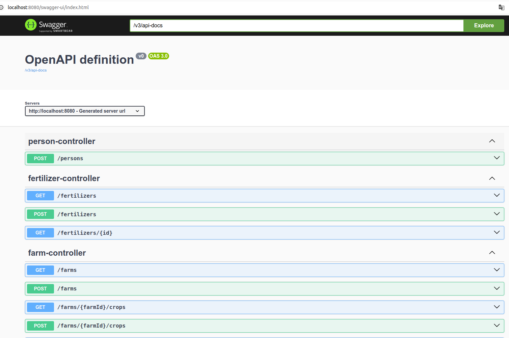

#  🌱 Agrix - Управление и Мониторинг Ферм 

## 🌐 [](https://github.com/SamuelRocha91/Agrix/blob/main/README.md) [](https://github.com/SamuelRocha91/Agrix/blob/main/README_es.md) [](https://github.com/SamuelRocha91/Agrix/blob/main/README_en.md) [](https://github.com/SamuelRocha91/Agrix/blob/main/README_ru.md) [](https://github.com/SamuelRocha91/Agrix/Agrix/blob/main/README_ch.md) [](https://github.com/SamuelRocha91/Agrix/blob/main/README_ar.md)

## 📜 Введение

Проект Agrix является оценочным проектом, разработанным в модуле Java курса веб-разработки Trybe. Проект включает использование Java, Maven, Docker, MySQL и почти всей экосистемы Spring. Приложение было построено с полной свободой реализации, охватывая всё от манипуляции кодом до конфигурации.

Цель приложения - управлять и мониторить фермы, которые стремятся улучшить свои технологии и использовать землю ответственно. Система включает маршруты для аутентификации, авторизации, регистрации ферм, управления посевами, удобрениями и многого другого.

## 📈 Диаграмма базы данных


## 🛤️ Маршруты

  


## 🛠️ Реализованные Функции

- **Аутентификация и Авторизация**: Реализация безопасности с использованием Spring Security для управления доступом к маршрутам приложения.
- **Регистрация Сущностей**: Маршруты для регистрации ферм, посевов и удобрений.
- **Управление Запасами и Посевами**: Функции для управления запасами удобрений и посевами на фермах.
- **REST API**: Разработка REST API для взаимодействия с системой.
- **Обработка Ошибок**: Реализация обработки ошибок с использованием Spring Web.
- **Docker**: Создание Dockerfile для конфигурации приложения для выполнения в Docker.

## 📚 Развиваемые Навыки

В процессе разработки этого проекта были отработаны следующие навыки:

- **Spring Framework**: Использование Spring для построения приложения и реализации безопасности.
- **Spring Security**: Применение знаний для добавления аутентификации и авторизации.
- **Java Web**: Разработка веб-приложения с использованием Java.
- **REST API**: Создание маршрутов API и реализация с использованием Spring.
- **Spring Data JPA**: Использование для хранения данных в базе данных.
- **Docker**: Конфигурация приложения для выполнения в контейнерах Docker.
- **JUnit**: Реализация тестов с использованием фреймворка JUnit.

## 📋 Требования

- **Java 17**
- **Maven 3.8.1 или выше**
- **Docker** (опционально, для выполнения в контейнерах)

## 🔧 Установка и Запуск

Следуйте инструкциям ниже для настройки и запуска проекта локально:

### 1. Клонируйте репозиторий

```bash
git clone git@github.com:SamuelRocha91/Agrix.git
```

### 2. Перейдите в директорию проекта

```bash
cd agrix
```

### 3. Скомпилируйте и запустите приложение

Для компиляции и запуска приложения локально используйте Maven:

```bash
mvn spring-boot:run
```

### 4. Запустите тесты

Для запуска автоматизированных тестов используйте команду:

```bash
mvn test
```

### 5. Настройка Docker

Для сборки и запуска приложения с использованием Docker следуйте инструкциям ниже:

1. Соберите Docker-образ:

   ```bash
   docker build -t agrix .
   ```

2. Запустите Docker-контейнер:

   ```bash
   docker run -p 8080:8080 agrix
   ```

## 🗂️ Структура Файлов

Структура проекта организована следующим образом:

```
.
├── src/
│   ├── main/
│   │   ├── java/
│   │   │   └── com/
│   │   │       └── betrybe/
│   │   │           └── agrix/
│   │   │               ├── controller/        # Контроллеры API
│   │   │               ├── model/             # Модели данных
│   │   │               ├── repository/        # JPA репозитории
│   │   │               ├── service/           # Сервисы приложения
│   │   │               └── AgrixApplication.java  # Основной класс
│   ├── test/
│   │   └── java/
│   │       └── com/
│   │           └── betrybe/
│   │               └── agrix/
│   │                   ├── controller/        # Тесты контроллеров
│   │                   ├── service/           # Тесты сервисов
│   │                   └── repository/        # Тесты репозиториев
├── Dockerfile                # Dockerfile для конфигурации приложения
├── pom.xml                   # Конфигурационный файл Maven
└── README.md                 # Документация проекта
```

## 📦 Зависимости

Основные зависимости проекта:

- [Spring Boot](https://spring.io/projects/spring-boot): Фреймворк для разработки приложений на Java.
- [Spring Security](https://spring.io/projects/spring-security): Фреймворк для безопасности и аутентификации.
- [Java JWT](https://github.com/auth0/java-jwt): Библиотека для манипуляции JWT.
- [MySQL Connector/J](https://dev.mysql.com/downloads/connector/j/): JDBC коннектор для MySQL.
- [JUnit](https://junit.org/junit5/): Фреймворк для модульного тестирования.

## Другие проекты

- 🗳️ [Sistema de Votação](https://github.com/SamuelRocha91/sistemaDeVotacao/blob/main/README_ru.md)
- 🏛️ [Localizador de museus](https://github.com/SamuelRocha91/localizadorDeMuseus/blob/main/README_ru.md)
- 📃 [Regras de progressão](https://github.com/SamuelRocha91/project_rule_of_progression/blob/main/README_ru.md)
